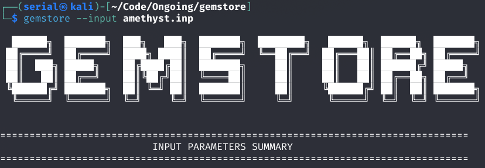

<div align="center">



# GEMSTORE: Hadron Spectroscopy Simulation Tools

[](https://www.gnu.org/licenses/gpl-3.0-or-later)
[](https://en.wikipedia.org/wiki/C_(programming_language))
[](https://en.wikipedia.org/wiki/Unix)


**A powerful computational framework for calculating hadron spectroscopy using the Gaussian Expanding Method (GEM) and Godfrey-Isgur quark models.**

</div>

---

## Overview

**GEMSTORE** is a specialized scientific software suite for hadron spectroscopy calculations using advanced quark models. It combines the computational efficiency of the **Gaussian Expanding Method** with the physics-rich **screen-modified Godfrey-Isgur (GI)** model to predict meson, baryon, and exotic hadron properties.

### Key Features

- 🎯 **Multiple Quark Models**: GI-Screen, GI-String
- 📊 **Spectral Calculations**: Masses, RMS radii, eigenvector analysis
- 🔧 **Flexible Quantum Numbers**: Full support for arbitrary L, S, J combinations
- 🤖 **AI-Assisted Workflows**: Integrated OpenCode assistant for intelligent task automation
- 📈 **Advanced Data Analysis**: Eigenvector analysis, normalization validation, statistical summaries
- ⚡ **High Performance**: Optimized C implementation with Minuit2 numerical library
- 🔬 **Parameter Fitting**: Gradient-based optimization with Minuit2

---

## Table of Contents

1. [Features](#features)
2. [System Requirements](#system-requirements)
3. [Installation](#installation)
4. [Quick Start](#quick-start)
5. [Core Algorithms](#core-algorithms)
6. [AI Integration](#ai-integration)
7. [Main Functions](#main-functions)
8. [Usage Examples](#usage-examples)
9. [Project Structure](#project-structure)
10. [Contributing](#contributing)
11. [License](#license)

---

## Features

### Physical Models

| Model | Description | Use Case |
|-------|-------------|----------|
| **GI-Screen** | Screen-modified Godfrey-Isgur potential with Coulomb screening | Heavy quarkonium (charmonium, bottomonium) |
| **GI-String** | String-like linear confinement | Light mesons and general meson spectra |

### Calculation Types

- **SPECTRA**: Calculate complete hadron mass spectra with eigenvectors
- **RADIUS**: Compute RMS radii and spatial distributions

### System Types

- **MESON**: Quark-antiquark bound states (qq̄)

### Basis Set Options

- **GEM** (Generalized Exponential Morse): Efficient Gaussian basis with exponential envelope
- **CRG** (Complex-Range Gaussian): Hiyama's complex scaling method

---

## System Requirements

### Minimum Requirements

- **OS**: Linux/Unix (macOS with GNU tools)
- **Compiler**: GCC 7.0+ or Clang 5.0+
- **Build Tool**: GNU Make 4.0+
- **Memory**: 512 MB RAM
- **Storage**: 100 MB installation + 1 GB for calculations

### Optional Dependencies

- **LAPACK/OpenBLAS**: For accelerated linear algebra
- **Python 3.7+**: For input file generation scripts
- **OpenCode**: For AI-assisted workflow integration

---

## Installation

### Clone the Repository

```bash
git clone https://github.com/serialcore/gemstore.git
cd gemstore
```

### Build from Source

```bash
# Standard build
make clean && make

# With LAPACK acceleration
make clean && make USE_LAPACKE=1

# Install to system (requires sudo)
make install

# Uninstall from system
make uninstall
```

### Verify Installation

```bash
./gemstore --help
./gemstore --version
```

---

## Quick Start

### Basic Usage

```bash
# Run a meson spectroscopy calculation with JSON input
./gemstore --compute test/amethyst.json

# Run calculation with CRG basis (complex scaling)
./gemstore --compute test/ruby.json

# Run with predefined parameters
./gemstore --compute test/diamond.json

# Fit parameters using Minuit2
./gemstore --fitting GIScreen_ccbar
```

### JSON Input Format

GEMSTORE uses JSON for configuration. Create `my_meson.json`:

```json
{
  "project": "my_project",
  "task": "SPECTRA",
  "model": {
    "type": "GISCREEN",
    "param": "GISCREEN_CCBAR"
  },
  "system": {
    "type": "MESON",
    "f1": 3,
    "f2": 3,
    "S": 1,
    "L": 0,
    "J": 1
  },
  "basis": {
    "type": "GEM",
    "nmax": 16,
    "rmax": 30.0,
    "rmin": 0.1
  },
  "print": {
    "pot": "false",
    "wfn": "false"
  }
}
```

Run it:

```bash
./gemstore --compute my_meson.json
```


### JSON Input Structure

#### Global Configuration

| Field | Type | Description | Examples |
|-------|------|-------------|----------|
| `project` | string | Project name (used for output files) | `"amethyst"`, `"myproject"` |
| `task` | string | Calculation type | `"SPECTRA"` |

#### Model Configuration

```json
"model": {
  "type": "GISCREEN" or "GISTRING",
  "param": "GISCREEN_CCBAR" or "GISTRING_CUSTOM",
  "file": "param_file.json"  // Only for CUSTOM params
}
```

**Predefined Parameter Sets:**
- `GISCREEN_CCBAR` - Charm-anticharm with GI-Screen model
- `GISCREEN_BBBAR` - Bottom-antibottom with GI-Screen model
- `GISTRING_MESON` - General mesons with GI-String model
- `GISCREEN_CUSTOM` - Custom parameters from file (requires `"file"` field)
- `GISTRING_CUSTOM` - Custom GI-String parameters from file

#### System Configuration

```json
"system": {
  "type": "MESON",
  "f1": <flavor_index>,
  "f2": <flavor_index>,
  "S": <spin>,
  "L": <orbital>,
  "J": <total_angular_momentum>
}
```

**Quark Flavors (indices):**
| Index | Quark | Mass (GeV) |
|-------|-------|-----------|
| 1 | n (up/down) | ~0.3-0.35 |
| 2 | s (strange) | ~0.42-0.53 |
| 3 | c (charm) | ~1.6-1.8 |
| 4 | b (bottom) | ~4.9-5.1 |

**Quantum Numbers:**
- `S`: Spin (0 = singlet, 1 = triplet)
- `L`: Orbital angular momentum (0, 1, 2, ...)
- `J`: Total angular momentum J = L + S or |L - S|

#### Basis Configuration

**GEM (Generalized Exponential Morse):**
```json
"basis": {
  "type": "GEM",
  "nmax": 16,
  "rmax": 30.0,
  "rmin": 0.1
}
```

**CRG (Complex-Range Gaussian):**
```json
"basis": {
  "type": "CRG",
  "nmax": 16,
  "rmax": 30.0,
  "rmin": 0.1,
  "omega": 0.1
}
```

| Field | Type | Description | Range |
|-------|------|-------------|-------|
| `type` | string | Basis set type | `"GEM"`, `"CRG"` |
| `nmax` | int | Number of Gaussian basis functions | 8-32 (typical: 16) |
| `rmax` | float | Maximum radius (fm) | 20.0-50.0 |
| `rmin` | float | Minimum radius (fm) | 0.01-0.5 |
| `omega` | float | Complex scaling angle (CRG only) | 0.05-0.5 |

#### Print Configuration

Controls output of potential and wavefunction files:

```json
"print": {
  "pot": "true",
  "wfn": "true"
}
```

| Field | Type | Description | Values |
|-------|------|-------------|--------|
| `pot` | string | Whether to write potential file | `"true"` or `"false"` |
| `wfn` | string | Whether to write wavefunction files | `"true"` or `"false"` |

- `"true"` → enabled (1)
- `"false"` → disabled (0)

When enabled:
- Potential: `<project>.pot.dat` (r, V)
- Wavefunction: `<project>.wfn.N.dat` (one file per state, r, φ(r))

### JSON Output Format

Generated by `write_meson_spectra()` in `src/print.c` (lines 234-379), GEMSTORE automatically creates `<project>.out.json`:

```json
{
  "generated": "2026-04-25 18:33:25",
  "project": "amethyst",
  "task": "SPECTRA",
  "model": { ... },
  "system": { ... },
  "basis": { ... },
  "states": [
    {
      "index": 1,
      "mass": 3.101986299943893,
      "rms_radius": 0.324597538486162,
      "eigenvector": [0.43147459..., 0.56587312..., ...]
    },
    ...
  ]
}
```

**Output Fields:**

| Field | Type | Description |
|-------|------|-------------|
| `generated` | string | ISO 8601 timestamp of calculation |

### Text Output Files (Controlled by `"print"` section)

When `"print":{"pot":"true"}` or `"print":{"wfn":"true"}` is set:

- **Potential**: `<project>.pot.dat` — two-column file (`r`, `V(r)`)
- **Wavefunction**: `<project>.wfn.N.dat` — one file per state (`r`, `φ(r)`)

Both files contain exactly 990 lines with `r` from 0.01 fm to 10.0 fm (Δr = 0.01 fm), matching the format used by Origin and similar plotting tools.

**Example output line:**
```text
0.01000000    -0.12345678e+00
```
| `project` | string | Project name (from input) |
| `task` | string | Calculation type (from input) |
| `model` | object | Model configuration (echoed from input) |
| `system` | object | System configuration (echoed from input) |
| `basis` | object | Basis configuration (echoed from input) |
| `states` | array | Array of eigenstate results |

**Per-State Data:**

| Field | Type | Description |
|-------|------|-------------|
| `index` | int | State index (1 to nmax) |
| `mass` | float | Eigenvalue/mass in GeV |
| `rms_radius` | float | Root-mean-square radius in fm |
| `eigenvector` | array | Expansion coefficients (length = nmax) |

### JSON Parameter File Format

Custom parameters can be supplied via external JSON file:

**param_custom.json:**
```json
{
  "param": {
    "mn": 0.220,
    "ms": 0.419,
    "mc": 1.628,
    "mb": 4.977,
    "b": 0.18,
    "c": -0.253,
    "sigma_0": 1.8,
    "s": 1.55,
    "epsilon_cont": -0.168,
    "epsilon_sov": -0.035,
    "epsilon_sos": 0.055,
    "epsilon_tens": 0.025
  }
}
```

**Reference to custom parameters:**
```json
{
  ...
  "model": {
    "type": "GISTRING",
    "param": "GISTRING_CUSTOM",
    "file": "param_custom.json"
  },
  ...
}
```

**Parameter Definitions:**

| Parameter | Description | Typical Range |
|-----------|-------------|----------------|
| `mn` | Up/down quark mass (GeV) | 0.2-0.35 |
| `ms` | Strange quark mass (GeV) | 0.4-0.6 |
| `mc` | Charm quark mass (GeV) | 1.6-1.8 |
| `mb` | Bottom quark mass (GeV) | 4.9-5.2 |
| `b` | String tension (GI-String) | 0.15-0.25 |
| `mu` | Screening length (GI-Screen) | 0.1-0.2 |
| `c` | Constant offset | -0.7 to 0.0 |
| `sigma_0` | Gaussian smearing width | 1.5-2.0 |
| `s` | Additional smearing parameter | 1.2-1.6 |
| `epsilon_cont` | Contact term strength | -0.3 to 0.0 |
| `epsilon_sov` | Spin-orbit coupling strength | -0.4 to 0.0 |
| `epsilon_sos` | Thomas precession strength | 0.0-1.0 |
| `epsilon_tens` | Tensor force strength | -0.5 to 0.1 |

---

## Core Algorithms

### 1. Gaussian Expanding Method (GEM)

The radial wavefunction is expanded in Gaussian basis functions:

```
ψ(r) = Σ cₙ φₙ(r)
```

where each basis function is:

```
φₙ(r) = r^ℓ exp(-αₙ r²)
```

**Advantages**:
- All integrals solvable in closed form
- Exponential convergence with basis size
- Efficient matrix computations

**Implementation**: `src/basis/orbit.c`, `src/math/integral.c`

### 2. Godfrey-Isgur Quark Model

The GI potential combines three components:

**A. Confinement Potential**
```
V_conf(r) = b₁ · r + b₂ + const
```

**B. Coulomb Interaction**
```
V_coul(r) = -αₛ(r) · Cᶠ / r
```

**C. Hyperfine Interactions**
- Spin-Spin: Contact term
- Spin-Orbit: L·S coupling
- Tensor: Tensor operator

**Implementation**: `src/model/gimodel.c` (20+ potential functions)

### 3. Eigenvalue Problem Solution

Converts the radial Schrödinger equation into a generalized eigenvalue problem:

```
H c = E S c
```

**Algorithm**:
1. Generate Gaussian basis set
2. Compute overlap matrix S (analytically)
3. Compute kinetic energy matrix T (analytically)
4. Compute potential energy matrix V (numerical integration)
5. Solve generalized eigenvalue problem
6. Extract masses and wavefunctions

**Implementation**: `src/math/eigen.c`, `src/model/spectra.c`

### 4. Spectral Data Post-Processing

The RMS radius spectrum is analyzed for anomalies using quadratic interpolation:

1. **Detect anomalies**: Identify non-monotonic points
2. **Interpolate**: Use Lagrange quadratic/linear interpolation
3. **Validate**: Check normalization and consistency

**Implementation**: `src/math/interplt.c` (enhanced with debugging)

### 5. Parameter Fitting Engine

Uses **Minuit2** numerical optimization library:
- MIGRAD: Gradient-based minimization
- SIMPLEX: Gradient-free optimization
- Parameter covariance matrix estimation

**Fit function**:
```
χ² = Σᵢ (M_calc^i - M_exp^i)² / σᵢ²
```

**Implementation**: `src/param/fitting.c`, `src/param/meson.cc`

---

## AI Integration

### OpenCode Assistant for GEMSTORE

The `app/gemstore-assistant/` subdirectory contains an **OpenCode skill** for intelligent task automation.

#### AI Capabilities

```
"Calculate charmonium 1P state with J=1"
         ↓
Parse quantum numbers, select model
         ↓
Generate input file automatically
         ↓
Execute gemstore calculation
         ↓
Parse results, format output
         ↓
"ψ(J^PC) = 1^-- with M = 3.686 GeV"
```

#### Features

- **Natural Language Understanding**: Parse physics requests
- **Automated Workflow**: Generate inputs, execute, parse outputs
- **Systematic Calculations**: Run multiple L, S, J combinations
- **Result Interpretation**: Physics-meaningful explanations
- **Parameter Fitting**: Intelligent model selection

#### Skill Location

```
app/gemstore-assistant/
├── SKILL.md                          # Main skill definition
├── scripts/generate_meson_inputs.py  # Auto-generate input files
└── templates/meson_spectra_template.md
```

#### Usage with OpenCode

```bash
# Enable AI-assisted calculations
opencode "Calculate charmonium spectrum up to L=2"

# Interactive model selection
opencode "Fit GIScreen parameters to experimental data"
```

For details: see `app/gemstore-assistant/SKILL.md`

---

## Main Functions

### Entry Points (src/entry.c)

| Function | Purpose | Call |
|----------|---------|------|
| `entry_compute()` | Run spectroscopy calculation | `--compute <file>` |
| `entry_fitting()` | Parameter optimization | `--fitting <target>` |
| `entry_debug()` | Debug calculation steps | `--debug <unit>` |

### Core Spectroscopy (src/model/)

| Function | Algorithm | Output |
|----------|-----------|--------|
| `spectra_meson_GEM()` | Solve Schrödinger equation (GEM basis) | Eigenvalues (masses) + eigenvectors |
| `spectra_meson_CRG()` | Solve Schrödinger equation (CRG basis) | Eigenvalues (masses) + eigenvectors |
| `radius_meson_GEM()` | Compute ⟨r²⟩^(1/2) with GEM basis | RMS radii |
| `radius_meson_CRG()` | Compute ⟨r²⟩^(1/2) with CRG basis | RMS radii |
| `interpolate_quadratic()` | Fix anomalies in spectra | Corrected data |
| `write_meson_spectra()` | Serialize results to JSON | `.out.json` file |

### Potential Functions (src/model/gimodel.c)

The implementation includes 22 complete potential components:

**Primary Interactions:**
```c
double GIVconf(double r, ...)     // Confinement (string or screened)
double GIVcoul(double r, ...)     // Coulomb (Gaussian screened)
double GIVcont(double r, ...)     // Contact term (delta-like)
```

**Spin-Dependent Interactions:**
```c
double GIVsovi(double r, ...)     // Spin-orbit coupling (quark 1)
double GIVsovj(double r, ...)     // Spin-orbit coupling (quark 2)
double GIVsovij(double r, ...)    // Mixed spin-orbit coupling
double GIVsosi(double r, ...)     // Thomas precession (quark 1)
double GIVsosj(double r, ...)     // Thomas precession (quark 2)
double GIVtens(double r, ...)     // Tensor force
```

**Smearing Parameters (9 functions):**
Gaussian smearing regularization for all potential components.

### Basis Functions (src/basis/)

| Module | Purpose |
|--------|---------|
| `orbit.c` | GEM and CRG orbital basis functions |
| `spin.c` | Spin SU(2) Clebsch-Gordan coefficients |
| `color.c` | SU(3) color factors |
| `isospin.c` | Isospin basis states |
| `intrin.c` | Intrinsic wavefunction representation |

### Mathematics (src/math/)

| Module | Algorithms |
|--------|-----------|
| `matrix.c` | Linear algebra |
| `eigen.c` | Generalized eigenvalue solver |
| `integral.c` | Gaussian quadrature integration |
| `cmi.c` | Color magnetic interaction |
| `soc.c` | Spin-orbit coupling |
| `su3.c` | SU(3) group operations |
| `interplt.c` | Spectral data interpolation |

---

## Usage Examples

### Example 1: Charmonium Ground State with Predefined Parameters

**Input file** (`cc_ground.json`):
```json
{
  "project": "charmonium_ground",
  "task": "SPECTRA",
  "model": {
    "type": "GISCREEN",
    "param": "GISCREEN_CCBAR"
  },
  "system": {
    "type": "MESON",
    "f1": 3,
    "f2": 3,
    "S": 0,
    "L": 0,
    "J": 0
  },
  "basis": {
    "type": "GEM",
    "nmax": 16,
    "rmax": 30.0,
    "rmin": 0.1
  },
  "print": {
    "pot": "false",
    "wfn": "false"
  }
}
```

**Run**:
```bash
./gemstore --compute cc_ground.json
```

**Output** (`charmonium_ground.out.json`):
```json
{
  "generated": "2026-04-25 18:33:25",
  "project": "charmonium_ground",
  "states": [
    {
      "index": 1,
      "mass": 3.096788,
      "rms_radius": 0.524365,
      "eigenvector": [0.43147..., 0.56587..., ...]
    },
    ...
  ]
}
```

### Example 2: Charmonium with Custom Parameters

**Parameter file** (`my_params.json`):
```json
{
  "param": {
    "mn": 0.220,
    "ms": 0.419,
    "mc": 1.747603574365,
    "mb": 5.095838715,
    "b": 0.248247135518,
    "mu": 0.1333931469096,
    "c": -0.5334999044266,
    "sigma_0": 1.56552865791,
    "s": 1.285723132711,
    "epsilon_cont": -0.2864647624566,
    "epsilon_sov": -0.349573212139,
    "epsilon_sos": 0.7905135472165,
    "epsilon_tens": -0.487322874302
  }
}
```

**Input file** (`cc_custom.json`):
```json
{
  "project": "charmonium_custom",
  "task": "SPECTRA",
  "model": {
    "type": "GISCREEN",
    "param": "GISCREEN_CUSTOM",
    "file": "my_params.json"
  },
  "system": {
    "type": "MESON",
    "f1": 3,
    "f2": 3,
    "S": 1,
    "L": 1,
    "J": 1
  },
  "basis": {
    "type": "GEM",
    "nmax": 16,
    "rmax": 30.0,
    "rmin": 0.1
  },
  "print": {
    "pot": "false",
    "wfn": "false"
  }
}
```

**Run**:
```bash
./gemstore --compute cc_custom.json
```

### Example 3: CRG Basis (Complex-Range Gaussian)

For resonance calculations, use complex scaling:

```json
{
  "project": "charmonium_crg",
  "task": "SPECTRA",
  "model": {
    "type": "GISCREEN",
    "param": "GISCREEN_CCBAR"
  },
  "system": {
    "type": "MESON",
    "f1": 3,
    "f2": 3,
    "S": 1,
    "L": 0,
    "J": 1
  },
  "basis": {
    "type": "CRG",
    "nmax": 16,
    "rmax": 30.0,
    "rmin": 0.1,
    "omega": 0.1
  },
  "print": {
    "pot": "false",
    "wfn": "false"
  }
}
```

**Run**:
```bash
./gemstore --compute charmonium_crg.json
```

### Example 4: Parameter Fitting

Fit GI-Screen parameters to experimental data using Minuit2:

```bash
./gemstore --fitting GIScreen_ccbar
```

This runs Minuit2 optimization to find parameters that best match experimental meson masses.

### Example 5: Light Mesons with GI-String Model

For light mesons (pions, kaons), GI-String model works better:

```json
{
  "project": "light_mesons",
  "task": "SPECTRA",
  "model": {
    "type": "GISTRING",
    "param": "GISTRING_MESON"
  },
  "system": {
    "type": "MESON",
    "f1": 1,
    "f2": 1,
    "S": 0,
    "L": 0,
    "J": 0
  },
  "basis": {
    "type": "GEM",
    "nmax": 16,
    "rmax": 30.0,
    "rmin": 0.1
  }
}
```

---

## Output Files

### JSON Output (.out.json)

Generated by `write_meson_spectra()` function in `src/print.c`:

When you run:
```bash
./gemstore --compute myfile.json
```

GEMSTORE automatically generates `myfile.out.json` with complete results in JSON format.

**Output File Structure:**

```json
{
  "generated": "2026-04-25 18:33:25",
  "project": "myproject",
  "task": "SPECTRA",
  "model": {
    "type": "GISCREEN",
    "param": "GISCREEN_CCBAR"
  },
  "system": {
    "type": "MESON",
    "f1": 3,
    "f2": 3,
    "S": 1,
    "L": 0,
    "J": 1
  },
  "basis": {
    "type": "GEM",
    "nmax": 16,
    "rmax": 30,
    "rmin": 0.1
  },
  "states": [
    {
      "index": 1,
      "mass": 3.101986299943893,
      "rms_radius": 0.324597538486162,
      "eigenvector": [0.43147459135290689, 0.56587312869939621, 0.56203519231094468, ...]
    },
    {
      "index": 2,
      "mass": 3.6707285768604248,
      "rms_radius": 0.53640308338098519,
      "eigenvector": [-0.31500074209555717, -0.28193707412502728, 0.0019418306107957378, ...]
    },
    ...
  ]
}
```

**Output Field Definitions:**

| Top-level Field | Type | Content |
|-----------------|------|---------|
| `generated` | string | ISO 8601 timestamp when calculation was performed |
| `project` | string | Project name from input (used as filename base) |
| `task` | string | Calculation type (e.g., `"SPECTRA"`) |
| `model` | object | Model configuration (echoed from input) |
| `system` | object | System quantum numbers (echoed from input) |
| `basis` | object | Basis set configuration (echoed from input) |
| `states` | array | Array of eigenstate results |

**Per-State Fields:**

| State Field | Type | Description |
|-------------|------|-------------|
| `index` | integer | State number (1 to nmax) |
| `mass` | float | Eigenvalue/mass in GeV |
| `rms_radius` | float | Root-mean-square radius in fm |
| `eigenvector` | array | Gaussian expansion coefficients (length = nmax) |

**Example Files in test/:**

- `test/amethyst.out.json` - Sample output with 16 states (GEM basis)
- `test/ruby.out.json` - Sample output with CRG basis
- `test/diamond.out.json` - Sample output with predefined parameters

**Output Generation Details:**

The `write_meson_spectra()` function (src/print.c:234-379):
1. Echoes all input configuration for reproducibility
2. Records generation timestamp
3. Outputs all eigenvalues as masses
4. Computes and outputs RMS radii
5. Includes normalized eigenvectors (expansion coefficients)
6. Writes to `<project>.out.json` in the current directory

This ensures all calculations are fully reproducible and can be analyzed with standard JSON tools or parsed by other applications.

---

## Project Structure

```
gemstore/
├── README.md                      # This file
├── LICENSE                        # GPLv3 license
├── Makefile                       # Build configuration
├── gemstore                       # Compiled executable
│
├── include/gemstore/              # Public API headers
│   ├── basis/                     # Wavefunction basis
│   ├── math/                      # Mathematics library
│   ├── model/                     # Physics models
│   ├── param/                     # Input parameters
│   └── entry.h, print.h           # Main interface
│
├── src/                           # Implementation (~5,000 LOC)
│   ├── main.c                     # Entry point
│   ├── entry.c                    # Task routing
│   ├── print.c                    # Output formatting (enhanced)
│   ├── basis/                     # Basis functions (~800 LOC)
│   ├── math/                      # Mathematics (~1200 LOC)
│   ├── model/                     # Physics models (~1800 LOC)
│   └── param/                     # Parameter fitting
│
├── lib/                           # External libraries
│   └── Minuit2/                   # Numerical optimization (CERN)
│
├── app/                           # AI Assistant for GEMSTORE
│   └── gemstore-assistant/        # OpenCode integration
│       ├── SKILL.md               # Skill definition
│       ├── scripts/               # Helper scripts
│       └── templates/             # Templates
│
├── test/                          # Test cases & examples
│   ├── amethyst.json              # Example: GEM basis
│   ├── ruby.json                  # Example: CRG basis
│   ├── diamond.json               # Example: predefined params
│   ├── amethyst.out.json          # Sample output
│   ├── param_GISCREEN.json        # GI-Screen parameters
│   ├── param_GISTRING.json        # GI-String parameters
│   └── ScreenFitting-*/           # Fitting datasets

Total LOC: ~7,800 (C + C++ + Headers)
```

---

## Building with LAPACK Acceleration

```bash
# Install LAPACK/OpenBLAS (Ubuntu/Debian)
sudo apt-get install liblapacke-dev libopenblas-dev

# Build with LAPACKE support
make clean && make USE_LAPACKE=1
```

---

## Contributing

### Guidelines

1. **Code Style**: K&R style with 4-space indentation
2. **Documentation**: Add docstrings for all public functions
3. **Testing**: Include unit tests for new algorithms
4. **Physics**: Cite literature for new models
5. **Performance**: Profile before optimizing

### Development Workflow

```bash
# Create feature branch
git checkout -b feature/my-algorithm

# Make changes and test
make clean && make

# Commit with descriptive messages
git add -A
git commit -m "Add [feature]: description"

# Push and open pull request
git push origin feature/my-algorithm
```

---

## Citation (not completed)

If you use GEMSTORE in research, please cite:

```bibtex
@software{gemstore2026,
  author = {Zhang, Wen-Xuan},
  title = {GEMSTORE: Hadron Spectroscopy Simulation Tools},
  year = {2026},
  url = {https://github.com/serialcore/gemstore},
  version = {0.1.4},
  note = {Gaussian Expanding Method + Godfrey-Isgur Quark Models}
}
```

### Academic References

1. Godfrey, S., & Isgur, N. (1985). "Mesons in a quark model with chromomagnetic interactions." *Physical Review D, 32*(1), 189.

2. Bhatnagar, V., et al. (1995). "Towards a consistent quark model for baryons." *International Journal of Modern Physics A, 10*(03), 335-392.

3. Fulton, R., et al. (1990). "Gaussian wave packets in the Hilbert space formalism." *Physical Review D*.

---

## License

**GEMSTORE** is licensed under the **GNU General Public License v3.0 or later** (GPLv3+).

- **SPDX Identifier**: `GPL-3.0-or-later`
- **Full License**: See `LICENSE` file
- **Copyright**: © 2026 Wen-Xuan Zhang

You are free to:
- ✓ Use for any purpose
- ✓ Modify and redistribute
- ✓ Include in research and commercial products

With the requirement that:
- ⚠ Derivative works must also be licensed under GPLv3+
- ⚠ Source code must be provided
- ⚠ License and copyright notice must be preserved

---

## Contact & Support

- **Author**: Wen-Xuan Zhang ([@serialcore](https://github.com/serialcore))
- **Email**: serialcore@outlook.com
- **Issues**: GitHub Issues tracker
- **AI Assistant**: See `app/gemstore-assistant/SKILL.md`

---

<div align="center">

**Made with ❤️ for computational hadron physics**

```
███████████████████████████████████████
████  GEMSTORE v0.1.4                ████
████  Hadron Spectroscopy Tools      ████
███████████████████████████████████████
```

*Last Updated: April 2026*

</div>
